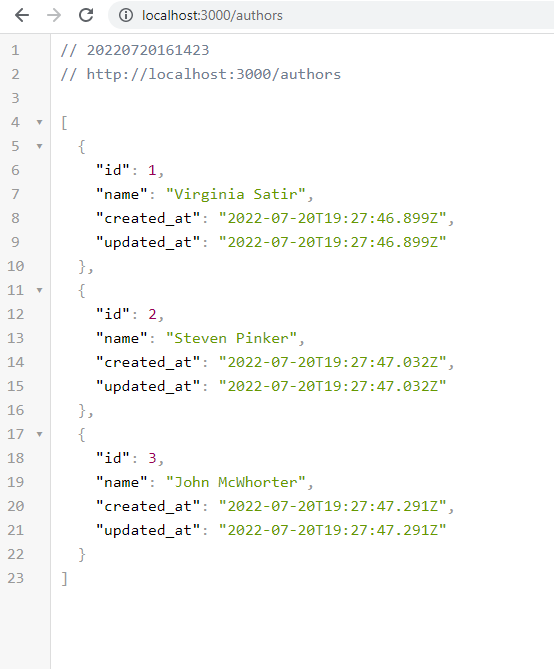
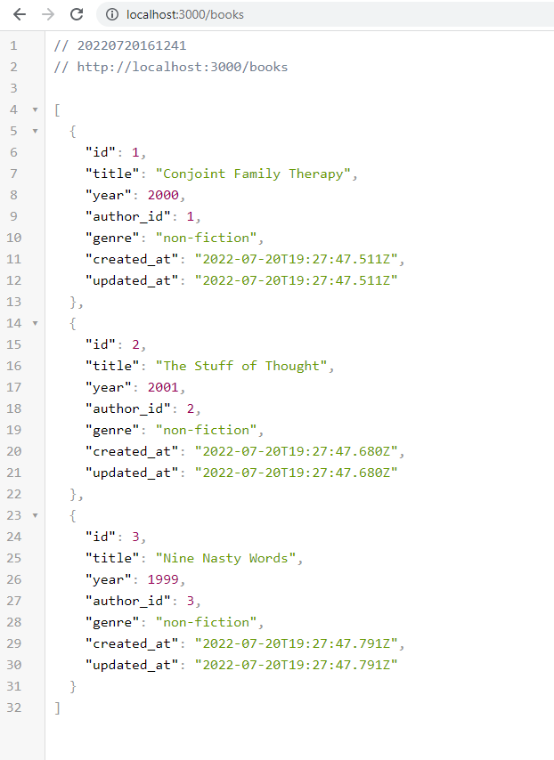

# Practicing Ruby on Rails JSON API

https://medium.com/swlh/beginners-guide-to-building-a-rails-api-7b22aa7ec2fb

### Milestones
[x] create new api app

[x] set settings for api

[x] generate models

[x] create migrations

[x] create seed info

[x] seed db

[x] test/query db

[x] generate controllers

[x] generate routes

[x] run server/access JSON info

#
api calls for authors and books

#
### Process for making API:

* mkdir railsapi

* rails new booktracker --api
	* Could use rails new booktracker --database=postgresql --api , to immediately set up postgresql

* In Gemfile uncomment gem "rack-cors"

* In terminal in railsapi/booktracker folder: bundle install

* In /config/intializers/cors.rb replace: origins: "example.com"  with single astrisk: "\*" 

* Generate models in the Terminal
	* rails g model Author name --no-testframework
	* rails g model Book title year:integer author_id:integer genre --no-testframework

* Create 2 migrations and 2 models in terminal with: 
	* rails db:create && rails db:migrate

* In booktracker/db/seeds.rb create seed information

* In terminal seed the database:
	* rails seed:db

* Test association by opening the rails console in the terminal:
	* rails console
	* book = Book.first
	* book.title

* Query the db (ex:)
	* rails db

	* SELECT *
	* FROM books
	* LIMIT 2;

* Generate Controllers: In terminal type
	* rails g controller Books
	* rails g controller Authors

* In app/controllers/books_controller.rb store all Books into variable and render json	
	* def index
		* books = Book.all
		* render json: books 
	* end

* Create index action route in config/routes.rb
	  * resources :books, only: [:index]

* create controller and route for author

* Run the server:
	* rails s

* localhost:3000/books, localhost:3000/authors
